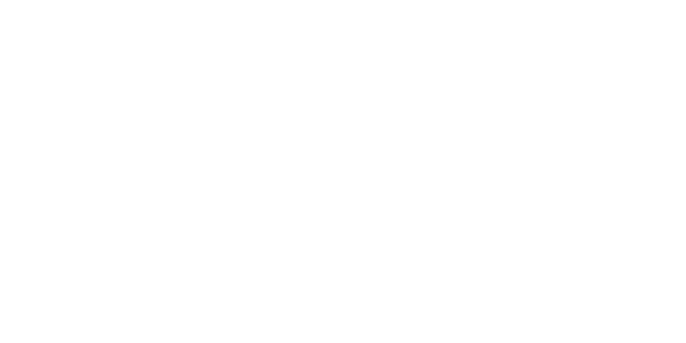

<p align="center">
  <picture>
    <source media="(prefers-color-scheme: dark)" srcset="./resources/logo-light.svg">
    <source media="(prefers-color-scheme: light)" srcset="./resources/logo-dark.svg">
    
  </picture>
</p>

A social networking application developed using the [NestJS](https://nestjs.com/) with
the power of [Fastify](https://fastify.dev/) and [Bun](https://bun.sh/).

## ✋ Requirements
Make sure you have **Bun** in the **latest version**, **Docker** and **Docker Compose**.

## 🛠️ Installation
Clone the repository using the following command
```bash
git clone https://github.com/hknsh/project-knedita.git
cd project-knedita
```
And then install the project dependencies
```bash
bun install
```

## ♻️ Environment Configuration
Before starting the project, configure the environment variables by creating a `.env` file in the project
root. You can use the `.env.example` file as reference.

**Disclaimer: make sure that the variable `MINIO_ROOT_PASSWORD` has 8 or more characters**

## 🏁 Running the project
Start the Docker containers with the command:
```bash
bun docker
```
This command will initialize the following services

- Postgres
- Redis
- MinIO
- API Server

After that, apply the migrations to the Postgres database:
```bash
bun migrate:deploy
```

Swagger will be available at the endpoint `/` on your browser.

## 📜 License

[MIT](https://choosealicense.com/licenses/mit/)
